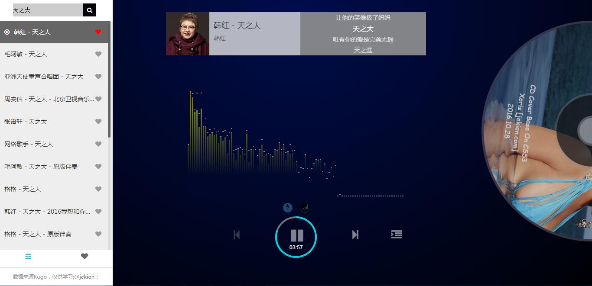

# html5mp3play

### 功能介绍
包含功能：在线音乐（酷狗）播放，音乐收藏，歌词显示，音频图谱；收藏和歌词采用本地存储。

[先睹为快](http://www.jekion.com);此DEMO播放不了在线音乐（没有环境）。
代码采用`Grunt`自动化管理；php环境需开启`curl_init`。
### 安装与运行
```
npm install
grunt

```
Apache+PHP环境
运行
`http://localhost/html5mp3play/`
### 缺点和申明：
1)因为要解码音频文件；所以加载有点慢。
2)CPU消耗有点高。（解码绘制音频图谱等）
3）学习研究可以，资源来源网络，你懂的。